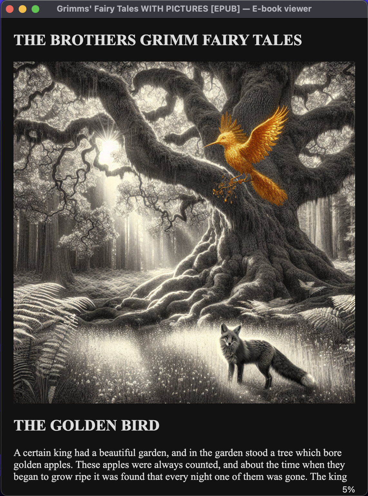

# inkbloom

> Transform your ebooks into illustrated masterpieces using AI

Inkbloom automatically generates and inserts contextually appropriate illustrations into EPUB ebooks, bringing stories to life with consistent, beautiful artwork.

---

## Overview

Inkbloom uses advanced AI models to analyze your ebook chapters, extract character and scene descriptions, and generate custom illustrations in your chosen artistic style. Perfect for enhancing public domain works, personal projects, or creating illustrated editions of your favorite stories.

**Example expired U.S. Copyright epubs from Project Gutenberg are included in the repo to try out.**

### Example Illustrations

*AI-generated illustrations for Grimm's Fairy Tales using DALL-E 3, visualized using Calibre*

<p align="center">
  
  
</p>

---

## Features

- Automatically extracts character and scene descriptions using Claude AI
- Generate illustrations in any artistic style (watercolor, oil painting, cartoon, etc.)
- Maintains visual consistency across all chapter illustrations
- Creates a new EPUB with illustrations seamlessly embedded
- Intelligently selects the most representative scene from each chapter

## Requirements

- Python 3.x
- API keys:
  - [Anthropic API](https://console.anthropic.com/) (Claude)
  - [OpenAI API](https://platform.openai.com/) (DALL-E 3)

---

## Installation

### 1. Install Dependencies

```bash
pip install anthropic ebooklib beautifulsoup4 openai requests pillow pyyaml
```

### 2. Configure API Keys

Create a `~/.secret/` directory and add your API key files:

**`~/.secret/anthropic_api_key.json`**
```json
{
  "SECRET_KEY": "your-anthropic-api-key-here"
}
```

**`~/.secret/openai_api_key.json`**
```json
{
  "SECRET_KEY": "your-openai-api-key-here"
}
```

---

## Usage

### Basic Command

```bash
python inkbloom.py <ebook_file> <style>
```

### Parameters

| Parameter | Description | Example Values |
|-----------|-------------|----------------|
| `ebook_file` | Path to your EPUB file | `"my_book.epub"` |
| `style` | Artistic style for illustrations | `"watercolor"`, `"oil painting"`, `"cartoon"`, `"pencil sketch"` |

### Example

```bash
python inkbloom.py "my_book.epub" "watercolor"
```

## How It Works

1. Claude identifies character physical descriptions and scenes
2. Claude selects the most representative scene from each chapter
3. Creates detailed prompts combining character descriptions with scene context
4. DALL-E generates illustrations based on the prompts
5. Illustrations are inserted after chapter headings
6. New EPUB file created with " WITH PICTURES" appended to filename

---

## Notes
* All content is filtered to be family-friendly (scary books/chapters will trigger the LLM's content errors)
* Usage incurs costs from both Anthropic and OpenAI 

### Generated Files

- `chapter_N_illustration.png` - Individual illustration files for each chapter
- `<original_filename> WITH PICTURES.epub` - Your new illustrated ebook

---

## Limitations

- EPUB format only (no support for MOBI, PDF, etc.)
- Requires active internet connection (relies on model APIs)
- Subject to API rate limits
- LLM API costs apply

---

## License

This project works with public domain books (expired U.S. Copyright). Always ensure you have the right to modify and redistribute any ebook you process.

---

<p align="center">
  Made with ❤️ using Claude AI & DALL-E 3
</p>
